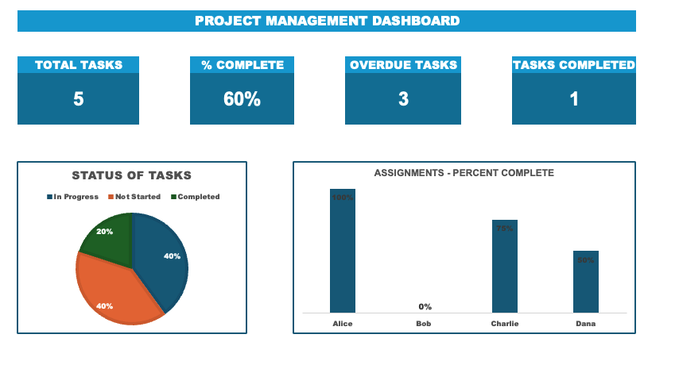

# 📊 Project Management Dashboard

An Excel-based dashboard that visualizes task assignments, completion status, and overdue items using pivot tables, conditional formatting, and KPI cards.

## 🔍 Overview

- Track total tasks, overdue tasks, and completed items
- Visualize % completion by team member
- Status pie chart shows task breakdown (In Progress, Not Started, Complete)
- Built with Excel formulas, pivot tables, and charts

## 🖼️ Preview

## 🛠️ Features

- `VLOOKUP`, `XLOOKUP`, `IF`, `IFERROR`
- Conditional formatting for task status
- KPI Cards using cell references from pivot tables
- Pivot table summaries

---

Built with ❤️ as part of a data analytics learning journey.
